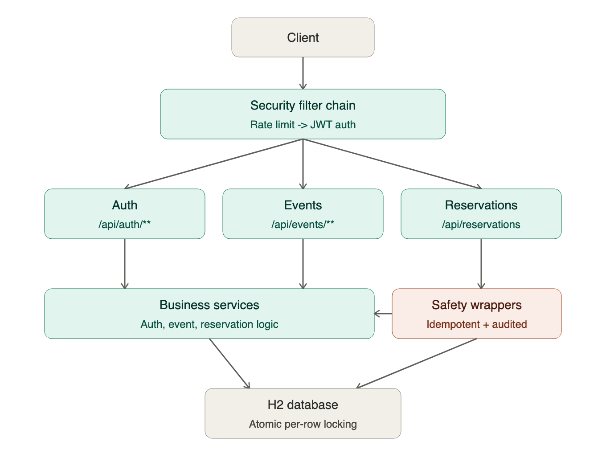

# Secure Ticketing & Reservation API

Event platform: organizers create and publish events, customers reserve seats.
No overselling under concurrency, idempotent reservation creation, JWT-based
auth with role-based authorization (RBAC).

Built with Spring Boot 4 / Java 21, H2 (in-memory), Spring Security, JJWT,
Bucket4j (rate limiting), springdoc-openapi.

---

## 1. Setup

### Prerequisites
- Java 21+
- Maven 3.9+

### Run locally
```bash
mvn clean install
mvn spring-boot:run
```
The API starts on `http://localhost:8080`. On startup, `DataSeeder` creates
three demo accounts (see [Seed users](#4-seed-users)) — no manual registration
needed to try the API immediately.

### Run with Docker (optional)
```bash
docker compose up --build
```
This is optional and mainly illustrative: the app uses in-memory H2, so no
external database container is required to run it. See
[Moving beyond H2](#8-moving-beyond-h2-production-notes) for what changes in a
real deployment.

### Run tests
```bash
mvn test
```
Includes unit tests (Mockito), Spring Boot integration tests against H2, a
multithreaded concurrency test proving no overselling, and RBAC security
tests over real HTTP calls (`TestRestTemplate` + a random port).

### Explore the API
- Swagger UI: `http://localhost:8080/swagger-ui.html`
- Raw OpenAPI JSON (always current, generated by springdoc): `http://localhost:8080/v3/api-docs`
- Hand-maintained static copy for offline review: [`openapi.yaml`](./openapi.yaml)
- H2 console (dev/demo only — see [known limitations](#7-known-limitations--things-id-do-differently-in-production)): `http://localhost:8080/h2-console` (JDBC URL `jdbc:h2:mem:ticketing`, user `sa`, empty password)
- Health: `http://localhost:8080/actuator/health`

---

## 2. Auth flow

1. `POST /api/auth/register` — creates a user with one or more roles
   (`ADMIN`, `ORGANIZER`, `CUSTOMER`). Password is BCrypt-hashed before
   storage; plaintext never touches the DB, logs, or audit trail.
2. `POST /api/auth/login` — verifies credentials, returns an **access token**
   (15 min TTL) and a **refresh token** (7 day TTL). The refresh token's
   SHA-256 hash (not the raw JWT) is persisted, so it can be revoked without a
   distributed blacklist.
3. Protected requests send `Authorization: Bearer <accessToken>`.
4. `POST /api/auth/refresh` — exchanges a valid, non-revoked refresh token for
   a **new** access+refresh pair. The old refresh token is revoked immediately
   (rotation): if a stolen refresh token gets replayed after the legitimate
   client already rotated it, the replay fails.

### Sample JWT (access token, decoded)

```
header:  { "alg": "HS256" }
payload: {
  "sub": "3f1e6c2a-9b7d-4e2f-8a1c-5d6e7f8a9b0c",
  "email": "organizer@ticketing.local",
  "roles": ["ORGANIZER"],
  "type": "access",
  "iat": 1752000000,
  "exp": 1752000900,
  "jti": "b6b6a6f0-1c2d-4e3f-9a8b-7c6d5e4f3a2b"
}
```

`type` distinguishes access vs. refresh tokens at the signature level — a
refresh token presented to a protected resource endpoint is rejected by
`JwtAuthenticationFilter` even though it carries a valid signature, because
only `type: "access"` is accepted there.

### Roles
| Role | Access |
|---|---|
| `ADMIN` | Full access to all resources |
| `ORGANIZER` | Full access to events they own (create/update/publish); cannot touch other organizers' events |
| `CUSTOMER` | Reservation operations (create/confirm/cancel own reservations) |

Role checks are two-layered: `@PreAuthorize` for coarse role gating (can this
role ever call this endpoint), and an explicit **ownership check** in the
service layer for anything resource-specific (is this organizer the owner of
*this* event) — ownership isn't expressible as a static role annotation
because it depends on the requested resource's data.

---

## 3. Architectural Decision Records



The ADRs below explain the reasoning behind each layer; the highlighted
"safety wrappers" box is `IdempotencyService` + `AuditService`, which sit
specifically in front of reservation writes (see ADR-06).

### ADR-01 — `Event.seatsReserved` (deviation from the literal entity spec)
The spec's `Event` entity lists `{id, ownerId, title, venue, startsAt, endsAt,
capacity, published, version}` only. A `seatsReserved` counter was added
because computing "seats taken" as `SUM(reservation.seats)` at read time
reintroduces exactly the read-then-write race the case is testing for (see
ADR-02). A denormalized counter, mutated exclusively through one atomic
statement, avoids that window entirely.

### ADR-02 — No-oversell strategy: conditional atomic UPDATE, not pessimistic locking
```sql
UPDATE event SET seats_reserved = seats_reserved + :n
WHERE id = :id AND published = true AND (seats_reserved + :n) <= capacity
```
- The capacity check and the increment happen in the **same statement**, so
  there's no gap between "check" and "write" for another transaction to land
  in. The database serializes concurrent UPDATEs on the same row regardless
  of isolation level above READ_UNCOMMITTED.
- Affected-row-count `0` means "didn't fit" — no exception thrown from the DB
  driver, no lock held across the rest of the transaction. This is why the
  approach out-throughputs `SELECT ... FOR UPDATE`: no lock is held any longer
  than the single UPDATE statement itself.
- `@Version` (optimistic locking) is used **separately**, for the non-capacity
  fields an organizer edits (title/venue/time) via `PUT /api/events/{id}`.
  These two concurrency problems have different shapes — one is "many actors
  racing to decrement a shared counter" (needs a serialized write), the other
  is "two people editing metadata, occasionally colliding" (optimistic
  locking with a reject-and-retry is enough) — so they get different tools.
  Verified end-to-end in `ReservationConcurrencyIT`, which fires 60 concurrent
  reservation requests at an event with capacity 20 and asserts exactly 20
  succeed.

### ADR-03 — JWT: short access token + hashed, rotating refresh token
Access tokens are stateless and carry roles as a claim, so authorization never
needs a DB round trip per request. Refresh tokens are the opposite: they must
be revocable, so only their SHA-256 hash is stored (mirroring password
hashing — if the table leaks, the tokens in it aren't directly usable), and
each use immediately revokes the old one (rotation), limiting the blast radius
of a stolen refresh token to a single use.

### ADR-04 — Rate limiting: Bucket4j, per-client, two policies
Two separate token-bucket policies, keyed by authenticated user id (falling
back to IP pre-auth): a tight bucket on `/api/auth/**` (credential-stuffing /
brute-force surface) and a separate bucket on reservation creation (the
write path most likely to be scripted-abused — "grab all the tickets").
In-memory buckets are correct for a single-instance deployment; a
multi-instance production deployment would move this to Redis
(`bucket4j-redis`) so limits are enforced cluster-wide, not per-node — noted
here rather than implemented, to keep the case's infra footprint at "one JVM,
no external services."

### ADR-05 — Audit logging survives the failures it documents
`AuditService.record(...)` runs in `Propagation.REQUIRES_NEW`. If the calling
business transaction rolls back (e.g. a reservation attempt rejected as sold
out), the audit record of that *attempt* must not roll back with it — a
sold-out rejection is exactly the kind of event a security/ops audit trail
exists to capture.

### ADR-06 — Idempotency: insert-first, not check-then-act
`IdempotencyKey` has a unique constraint on `(key_value, endpoint)`. The
service tries to **insert** a new `IN_PROGRESS` row in its own committed
transaction before running the business action; if a concurrent request
raced it, the insert fails on the unique constraint and that request instead
loads and inspects the row that won. This avoids the classic idempotency bug
where two simultaneous retries both pass a "does this key exist?" check
before either has written anything.
- Same key + same request hash + `COMPLETED` → replay the stored response,
  don't re-run the business logic.
- Same key + **different** request hash → `409` (key reuse with a different
  payload is a client bug, not a retry).
- Same key currently `IN_PROGRESS` → `409` (two concurrent requests with the
  same key; the second one doesn't get to guess at the first one's outcome).
- Same key `FAILED` → `409` telling the caller to retry with a new key (a
  failed attempt doesn't permanently burn the key, but also isn't silently
  replayed as if it had succeeded).

One implementation note worth flagging explicitly: the three DB steps
(begin/complete/fail) live in a separate Spring bean
(`IdempotencyTransactionalOps`), not as `@Transactional(REQUIRES_NEW)` methods
called from within `IdempotencyService` itself. Self-invoking a
`@Transactional` method (calling `this.method()` from inside the same class)
bypasses the Spring AOP proxy entirely, silently ignoring the propagation
setting — a well-known but easy-to-miss pitfall. Splitting the transactional
boundary into a distinct, externally-invoked bean was a deliberate fix for
that, not an accident of structure.

### ADR-07 — Exception model: typed exceptions + RFC 7807 (`ProblemDetail`)
Every domain exception extends `ApiException` (status + machine-readable error
code + message). `GlobalExceptionHandler` is the **only** place that
constructs HTTP error responses, using Spring 6's built-in `ProblemDetail`
(`application/problem+json`). Controllers and services never build
`ResponseEntity` error bodies directly — that discipline is what keeps 15+
endpoints returning a consistent error shape instead of each one inventing
its own.

### ADR-08 — Layering
`controller → service → repository`, with DTOs (Java records) as the
boundary between the HTTP layer and the domain model — entities never leak
directly into request/response bodies. Ownership/ACL checks live in the
service layer (they're data-dependent); role gating lives at the controller
via `@PreAuthorize` (it's static per-endpoint). `AuditService` and
`IdempotencyService` are cross-cutting concerns injected where needed rather
than woven in via AOP/aspects, favoring explicitness over "magic" for a
case-study-sized codebase.

---

## 4. Seed users
Created automatically on startup by `DataSeeder` (idempotent — safe to
restart):

| Email | Password | Role |
|---|---|---|
| `admin@ticketing.local` | `Admin123!` | ADMIN |
| `organizer@ticketing.local` | `Organizer123!` | ORGANIZER |
| `customer@ticketing.local` | `Customer123!` | CUSTOMER |

---

## 5. Example curl walkthrough

```bash
# 1. Login as organizer
TOKEN=$(curl -s -X POST localhost:8080/api/auth/login \
  -H 'Content-Type: application/json' \
  -d '{"email":"organizer@ticketing.local","password":"Organizer123!"}' | jq -r .accessToken)

# 2. Create a draft event
EVENT_ID=$(curl -s -X POST localhost:8080/api/events \
  -H "Authorization: Bearer $TOKEN" -H 'Content-Type: application/json' \
  -d '{"title":"Spring Meetup","venue":"Istanbul","startsAt":"2026-09-01T18:00:00Z","endsAt":"2026-09-01T21:00:00Z","capacity":100}' \
  | jq -r .id)

# 3. Publish it
curl -s -X POST localhost:8080/api/events/$EVENT_ID/publish -H "Authorization: Bearer $TOKEN"

# 4. Login as customer and reserve seats (Idempotency-Key required)
CUSTOMER_TOKEN=$(curl -s -X POST localhost:8080/api/auth/login \
  -H 'Content-Type: application/json' \
  -d '{"email":"customer@ticketing.local","password":"Customer123!"}' | jq -r .accessToken)

curl -s -X POST localhost:8080/api/events/$EVENT_ID/reservations \
  -H "Authorization: Bearer $CUSTOMER_TOKEN" -H 'Content-Type: application/json' \
  -H "Idempotency-Key: $(uuidgen)" \
  -d '{"seats":2}'
```

---

## 6. Testing

| Test | Type | Covers |
|---|---|---|
| `JwtServiceTest` | Unit (JUnit5) | Token generation/validation, tampering & wrong-key rejection, SHA-256 hashing |
| `ReservationServiceTest` | Unit (Mockito) | Sold-out rejection, unpublished-event rejection, ownership checks, seat release on cancel |
| `EventReservationFlowIT` | Integration | Full happy path: register → login → create draft → publish → reserve → confirm → cancel |
| `ReservationConcurrencyIT` | Integration, multithreaded | 60 concurrent reservation attempts against 20 capacity → exactly 20 succeed, 40 rejected as sold out |
| `IdempotencyIT` | Integration | Replay on same key+body, 409 on same key+different body, 400 on missing key |
| `SecurityAccessIT` | Integration (security) | Role gating (customer can't create events), ownership gating (organizer can't touch another's event), public endpoint requires no auth, missing/tampered token → 401 |

Run everything: `mvn test`. Integration tests spin up the full Spring context
on a random port against H2 (`ddl-auto=create-drop`, fresh schema per test
class via `@DirtiesContext`).

---

## 7. Known limitations / things I'd do differently in production
- **H2 console is exposed** (`/h2-console`, frame-options disabled) purely for
  local inspection during the case review. This would never ship enabled in a
  real deployment.
- **JWT secret has a checked-in dev default** (env-overridable via
  `JWT_SECRET`). In production this comes from a secret manager, never source
  control.
- **Rate limiting is in-memory**, so it's per-instance, not cluster-wide —
  fine for one JVM, would move to Redis-backed Bucket4j behind a load
  balancer.
- **No pagination** on `GET /api/events` / `/api/events/public` — acceptable
  at case-study scale, not at real catalog scale.
- **CORS allows `localhost:*`** as a demo default — must be locked to real
  origins before any production exposure.

## 8. Moving beyond H2 (production notes)
Swapping H2 for Postgres only touches `application.yml`
(`spring.datasource.*` + the Postgres driver dependency) and `ddl-auto` (move
to Flyway/Liquibase migrations instead of `update`). The oversell-guard query
(`EventRepository#tryReserveSeats`) is plain JPQL and needs no changes — the
"single atomic UPDATE" pattern is standard SQL behavior, not an H2-specific
trick.
